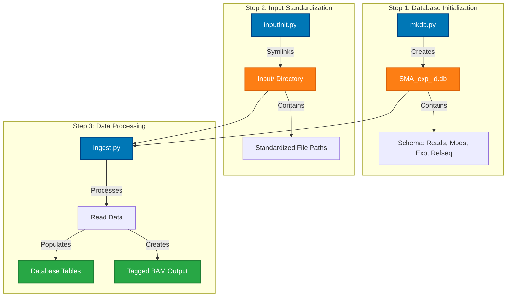
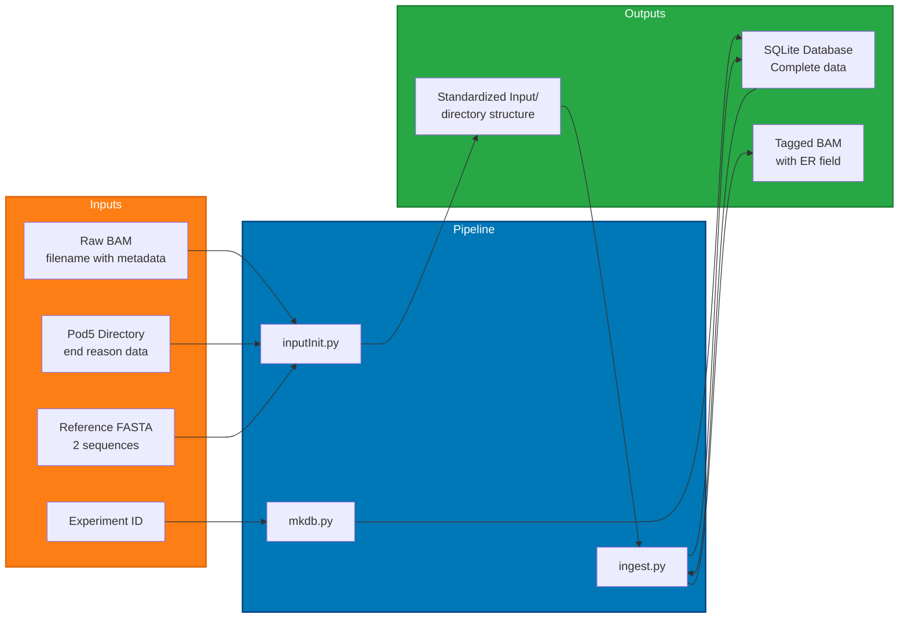
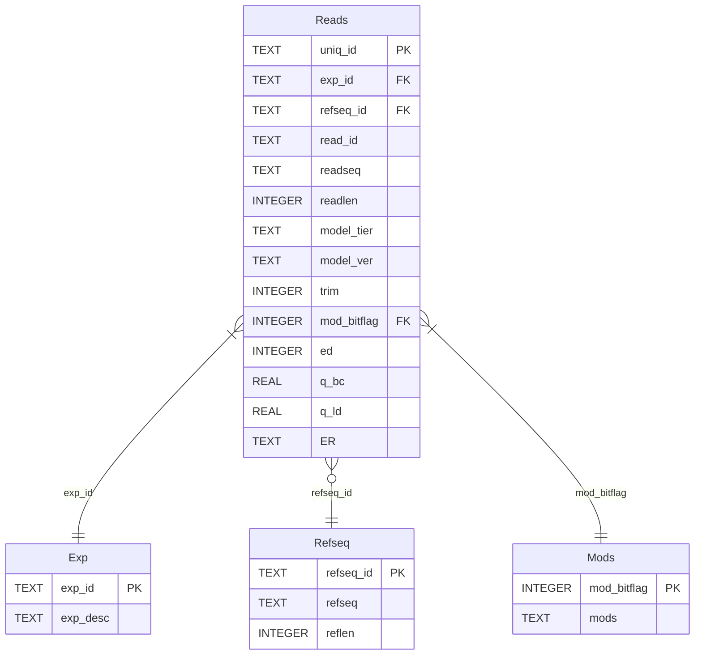
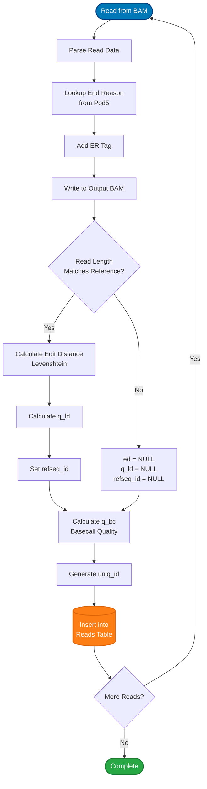
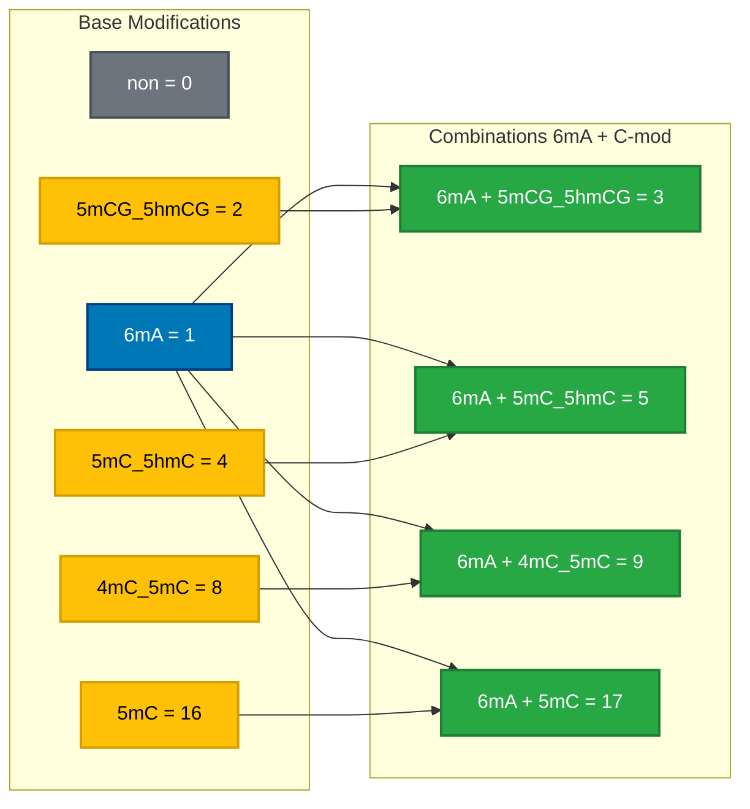
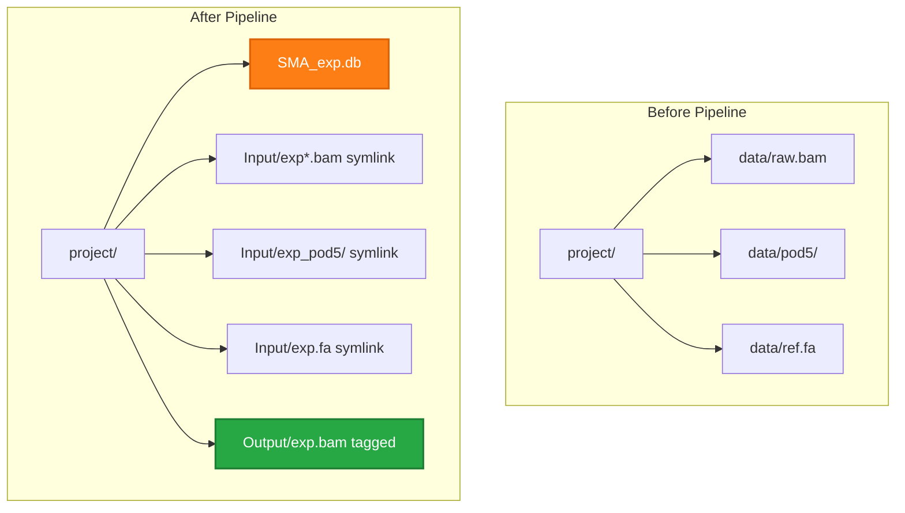
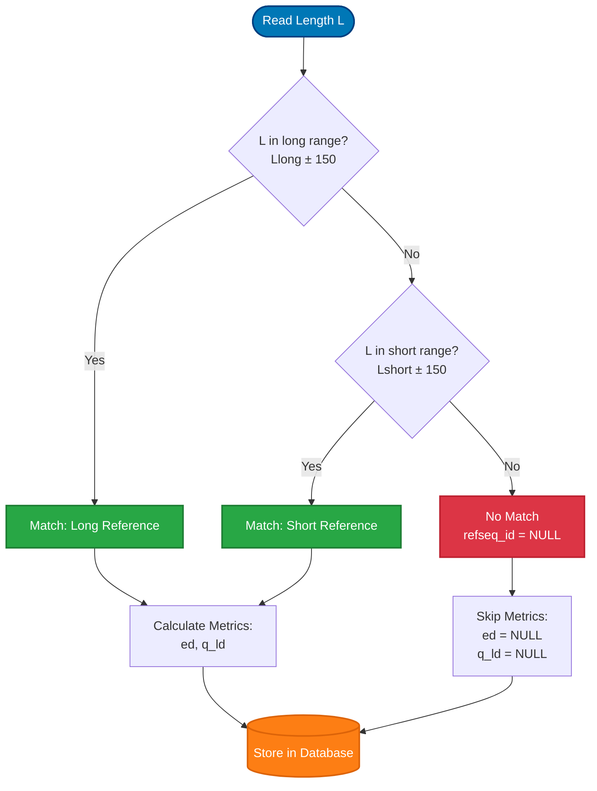

# ONT-SMA-seq Diagrams

Quick reference diagrams for the ONT-SMA-seq pipeline.

## Pipeline Architecture



## Input/Output Summary



## Data Structure: Database Schema



## Read Processing Flow



## Data Transformations

### Input BAM Filename → Metadata

```
Filename: EXP001_h_v5.2.0_1_6mA.bam
         ↓
Parsed Metadata:
  • exp_id: EXP001
  • model_tier: h (high accuracy)
  • model_ver: 5.2.0
  • trim: 1 (trimmed)
  • mods_str: 6mA
  • mod_bitflag: 1
```

### Read → Database Record

```
Input Read:
  • read_id: abc123...
  • sequence: ATCG...
  • quality: [30, 32, 28...]
  • length: 1500

Processing:
  • Match to reference (length 1450 ± 150) ✓
  • Calculate ed = 15 (Levenshtein)
  • Calculate q_bc = 31.5
  • Calculate q_ld = 19.2
  • Generate uniq_id: EXP001h520t1m1_a3f2d8e1

Database Record:
  uniq_id: EXP001h520t1m1_a3f2d8e1
  exp_id: EXP001
  refseq_id: reference_short
  read_id: abc123...
  readseq: ATCG...
  readlen: 1500
  model_tier: h
  model_ver: 5.2.0
  trim: 1
  mod_bitflag: 1
  ed: 15
  q_bc: 31.5
  q_ld: 19.2
  ER: signal_positive
```

## Modification Bitflags



## Directory Structure Before/After



## Metric Calculations

### Basecall Quality (q_bc)

```
Input: Quality scores [Q1, Q2, Q3, ..., Qn]

Step 1: Convert to error probabilities
  P_error = 10^(-Q/10)

Step 2: Calculate mean error
  mean_P = Σ(P_error) / n

Step 3: Convert back to quality
  q_bc = -10 * log10(mean_P)
```

### Levenshtein Quality (q_ld)

```
Input: 
  - ed (edit distance)
  - L (reference length)

Step 1: Calculate ratio
  ratio = ed / L

Step 2: Apply bounds
  bounded = min(max(1/L², ratio), 1)

Step 3: Convert to quality
  q_ld = -10 * log10(bounded)
```

### Unique ID Generation

```
Components:
  - exp_id: EXP001
  - tier: h
  - ver: 5.2.0 → 520
  - trim: 1
  - mod_bitflag: 1
  - read_hash: MD5(read_id)[:8]

Format: {exp_id}{tier}{ver}t{trim}m{mod}_{hash}
Result: EXP001h520t1m1_a3f2d8e1
```

## Reference Matching Logic


