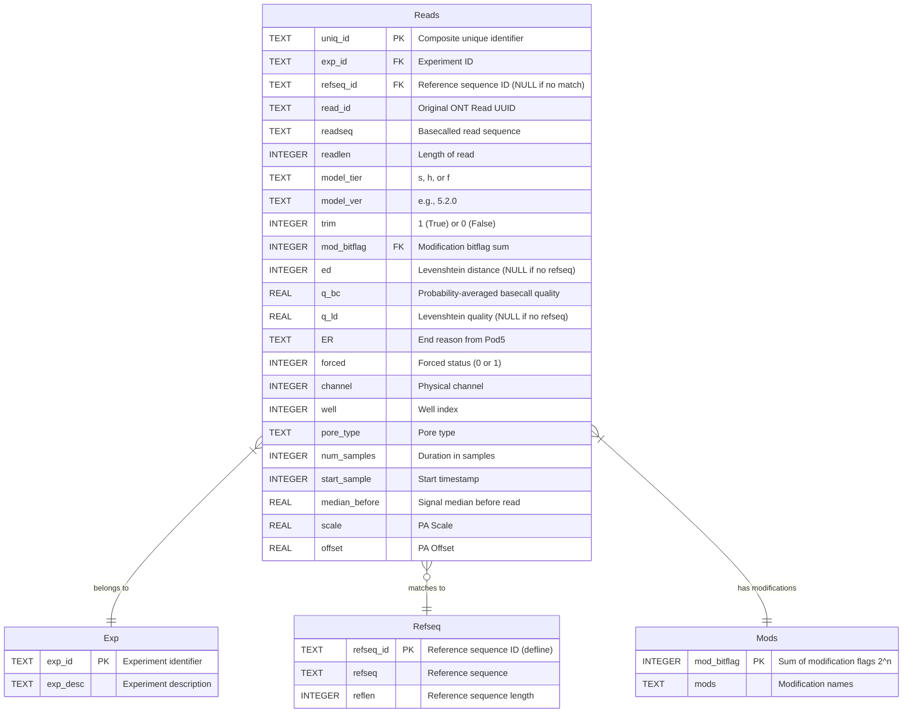
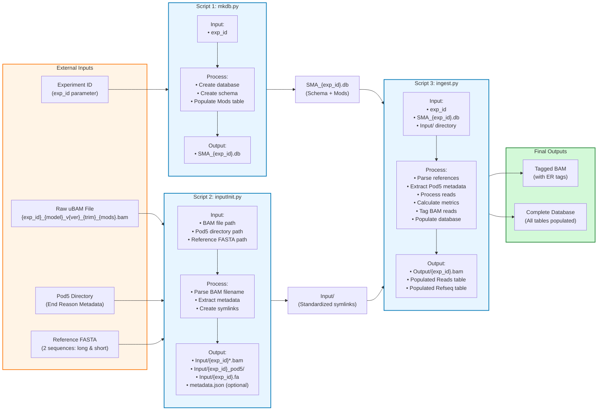

# ONT-SMA-seq Workflow and Data Structure

This document provides comprehensive diagrams showing the workflow, data structures, and data flow for the ONT-SMA-seq pipeline.

## Table of Contents
- [Pipeline Workflow Flowchart](#pipeline-workflow-flowchart)
- [Database Schema Diagram](#database-schema-diagram)
- [Data Flow Diagram](#data-flow-diagram)
- [Script Details](#script-details)

---

## Pipeline Workflow Flowchart

This flowchart shows the complete pipeline execution flow from initialization to final output.

```mermaid
flowchart TD
    Start([Start Pipeline]) --> Step1[Script 1: mkdb.py]
    
    Step1 --> CreateDB[Create SQLite Database<br/>SMA_exp_id.db]
    CreateDB --> CreateTables[Create Tables:<br/>Reads, Mods, Exp, Refseq]
    CreateTables --> PopulateMods[Populate Mods Table<br/>with Bitflag Definitions]
    PopulateMods --> DB_Ready[Database Ready]
    
    DB_Ready --> Step2[Script 2: inputInit.py]
    
    Step2 --> ParseFilename[Parse BAM Filename<br/>Extract Metadata:<br/>exp_id, model, ver,<br/>trim, modifications]
    ParseFilename --> CreateInputDir[Create Input/ Directory]
    CreateInputDir --> Symlink1[Create Symlink:<br/>BAM → Input/]
    Symlink1 --> Symlink2[Create Symlink:<br/>Pod5 Dir → Input/]
    Symlink2 --> Symlink3[Create Symlink:<br/>Reference FASTA → Input/]
    Symlink3 --> Input_Ready[Input Structure Ready]
    
    Input_Ready --> Step3[Script 3: ingest.py]
    
    Step3 --> ParseRef[Parse Reference FASTA<br/>Calculate length ranges<br/>min = len - 150<br/>max = len + 150]
    ParseRef --> InsertRefseq[Insert into Refseq Table]
    InsertRefseq --> ParsePod5[Parse Pod5 Files<br/>Extract End Reasons<br/>Build read_id → end_reason map]
    
    ParsePod5 --> CreateOutput[Create Output/ Directory]
    CreateOutput --> OpenBAM[Open Input BAM<br/>Open Output BAM]
    
    OpenBAM --> ReadLoop{For Each Read}
    
    ReadLoop --> GetER[Lookup End Reason<br/>from Pod5 map]
    GetER --> AddTag[Add ER Tag to Read]
    AddTag --> WriteBAM[Write to Output BAM]
    WriteBAM --> MatchRef{Read Length<br/>in Reference<br/>Range?}
    
    MatchRef -->|Yes| CalcED[Calculate Edit Distance<br/>ed = Levenshtein<br/>read_seq, ref_seq]
    CalcED --> CalcQLD[Calculate q_ld<br/>-10*log10(min(max(<br/>1/L², ed/L), 1))]
    CalcQLD --> SetRef[Set refseq_id]
    
    MatchRef -->|No| SetNull[Set refseq_id = NULL<br/>ed = NULL<br/>q_ld = NULL]
    
    SetRef --> CalcQBC[Calculate q_bc<br/>Probability-averaged<br/>basecall quality]
    SetNull --> CalcQBC
    
    CalcQBC --> GenID[Generate uniq_id<br/>exp_id+tier+ver+<br/>t+trim+m+mod+hash]
    GenID --> InsertDB[Insert Record<br/>into Reads Table]
    
    InsertDB --> Commit{Processed<br/>10,000 reads?}
    Commit -->|Yes| CommitDB[Commit to Database]
    CommitDB --> MoreReads{More Reads?}
    Commit -->|No| MoreReads
    
    MoreReads -->|Yes| ReadLoop
    MoreReads -->|No| FinalCommit[Final Commit]
    
    FinalCommit --> CloseFiles[Close BAM Files<br/>Close Database]
    CloseFiles --> Complete([Pipeline Complete])
    
    style Step1 fill:#e1f5ff,stroke:#0077b6,stroke-width:2px
    style Step2 fill:#e1f5ff,stroke:#0077b6,stroke-width:2px
    style Step3 fill:#e1f5ff,stroke:#0077b6,stroke-width:2px
    style Complete fill:#90ee90,stroke:#006400,stroke-width:3px
    style Start fill:#ffffcc,stroke:#cc9900,stroke-width:2px
```

---

## Database Schema Diagram

This diagram shows the database structure with all tables, columns, data types, and relationships.



### Modification Bitflags

| Modification | Bit Value (2^n) | Integer | Logic |
|:------------|:---------------|:--------|:------|
| **non** | 0 | 0 | No modifications |
| **6mA** | 2^0 = 1 | 1 | Independent (can coexist) |
| **5mCG_5hmCG** | 2^1 = 2 | 2 | Mutually exclusive C-Mod |
| **5mC_5hmC** | 2^2 = 4 | 4 | Mutually exclusive C-Mod |
| **4mC_5mC** | 2^3 = 8 | 8 | Mutually exclusive C-Mod |
| **5mC** | 2^4 = 16 | 16 | Mutually exclusive C-Mod |

**Combinations:** 6mA can combine with C-mods (e.g., 6mA + 5mC = 1 + 16 = 17)

### Metric Formulas

1. **Basecall Quality (q_bc):**
   ```
   q_bc = -10 * log10(Σ(10^(-Q_base/10)) / n)
   ```

2. **Levenshtein Distance (ed):**
   ```
   ed = Levenshtein(read_seq, ref_seq)
   ```

3. **Levenshtein Quality (q_ld):**
   ```
   q_ld = -10 * log10(min(max(1/L², ed/L), 1))
   where L = reference length
   ```

4. **Unique ID (uniq_id):**
   ```
   {exp_id}{tier}{ver}t{trim}m{mod_flag}_{read_hash}
   Example: EXP001h520t1m1_a3f2d8e1
   ```

---

## Data Flow Diagram

This diagram shows inputs and outputs for each script in the pipeline.



---

## Script Details

### Script 1: mkdb.py (Database Initialization)

**Purpose:** Initialize the SQLite database schema and populate static lookup tables.

**Inputs:**
- `exp_id` (command-line argument)

**Outputs:**
- `SMA_{exp_id}.db` (SQLite database file)

**Tables Created:**
- `Reads` - Main data table (initially empty)
- `Mods` - Modification bitflag lookup table (populated)
- `Exp` - Experiment metadata (schema only)
- `Refseq` - Reference sequences (schema only)

**Command:**
```bash
python mkdb.py <exp_id>
```

---

### Script 2: inputInit.py (Input Standardization)

**Purpose:** Standardize input file locations and extract metadata from filenames.

**Inputs:**
- `--bam` / `-b`: Path to raw uBAM file
  - Must follow naming convention: `{exp_id}_{bc_model_type}_v{bc_model_version}_{trim}_{modifications}.bam`
- `--pod5` / `-p`: Path to Pod5 directory
- `--ref` / `-r`: Path to reference FASTA file
- `--force` / `-f`: (Optional) Force overwrite existing symlinks
- `--output-json` / `-o`: (Optional) Save metadata to JSON file

**Outputs:**
- `Input/{exp_id}_{model}_v{ver}_{trim}_{mods}.bam` (symlink)
- `Input/{exp_id}_pod5/` (symlink)
- `Input/{exp_id}.fa` (symlink)
- `metadata.json` (optional)

**Metadata Extracted:**
- `exp_id`: Experiment identifier
- `model_tier`: s (super), h (high), or f (fast)
- `model_ver`: Model version (e.g., 5.2.0)
- `trim`: 0 or 1
- `mod_bitflag`: Calculated from modification names

**Command:**
```bash
python inputInit.py --bam <bam_path> --pod5 <pod5_dir> --ref <ref_fasta>
```

---

### Script 3: ingest.py (Main Processing)

**Purpose:** Core data processing pipeline - parse inputs, calculate metrics, tag BAMs, and populate database.

**Inputs:**
- `exp_id` (command-line argument)
- `--db`: (Optional) Path to database (default: `SMA_{exp_id}.db`)
- `--input-dir`: (Optional) Input directory (default: `Input`)
- `--output-dir`: (Optional) Output directory (default: `Output`)

**Processing Steps:**
1. Parse reference FASTA (2 sequences)
2. Calculate length ranges (length ± 150)
3. Insert references into Refseq table
4. Extract Pod5 metadata (end reasons)
5. Stream BAM reads:
   - Lookup end reason
   - Add ER tag
   - Write to output BAM
   - Match to reference by length
   - Calculate edit distance (if matched)
   - Calculate quality metrics (q_bc, q_ld)
   - Generate unique ID
   - Insert into Reads table

**Outputs:**
- `Output/{exp_id}.bam` (BAM with ER tags)
- Populated `Reads` table in database
- Populated `Refseq` table in database

**Metrics Calculated:**
- `q_bc`: Probability-averaged basecall quality
- `ed`: Levenshtein edit distance (NULL if no reference match)
- `q_ld`: Levenshtein quality score (NULL if no reference match)

**Command:**
```bash
python ingest.py <exp_id>
```

---

## File Structure

### Before Pipeline:
```
project/
├── mkdb.py
├── inputInit.py
├── ingest.py
└── data/
    ├── raw_data.bam
    ├── pod5_files/
    └── reference.fa
```

### After Pipeline:
```
project/
├── mkdb.py
├── inputInit.py
├── ingest.py
├── SMA_{exp_id}.db          # Database with all data
├── Input/                    # Standardized inputs (symlinks)
│   ├── {exp_id}*.bam
│   ├── {exp_id}_pod5/
│   └── {exp_id}.fa
├── Output/                   # Processed outputs
│   └── {exp_id}.bam         # Tagged BAM with ER field
└── data/                     # Original raw data
    ├── raw_data.bam
    ├── pod5_files/
    └── reference.fa
```

---

## Quick Start

Run the complete pipeline:

```bash
# Step 1: Initialize database
python mkdb.py EXP001

# Step 2: Standardize inputs
python inputInit.py \
  --bam data/EXP001_h_v5.2.0_1_6mA.bam \
  --pod5 data/pod5/ \
  --ref data/reference.fa

# Step 3: Process and ingest data
python ingest.py EXP001
```

---

## Dependencies

- Python 3.x
- `pysam` - BAM I/O
- `pod5` - End reason extraction
- `edlib` - Levenshtein distance calculation
- `sqlite3` - Database (built-in)
- `argparse` - CLI (built-in)

Install dependencies:
```bash
pip install pysam pod5 edlib
```
